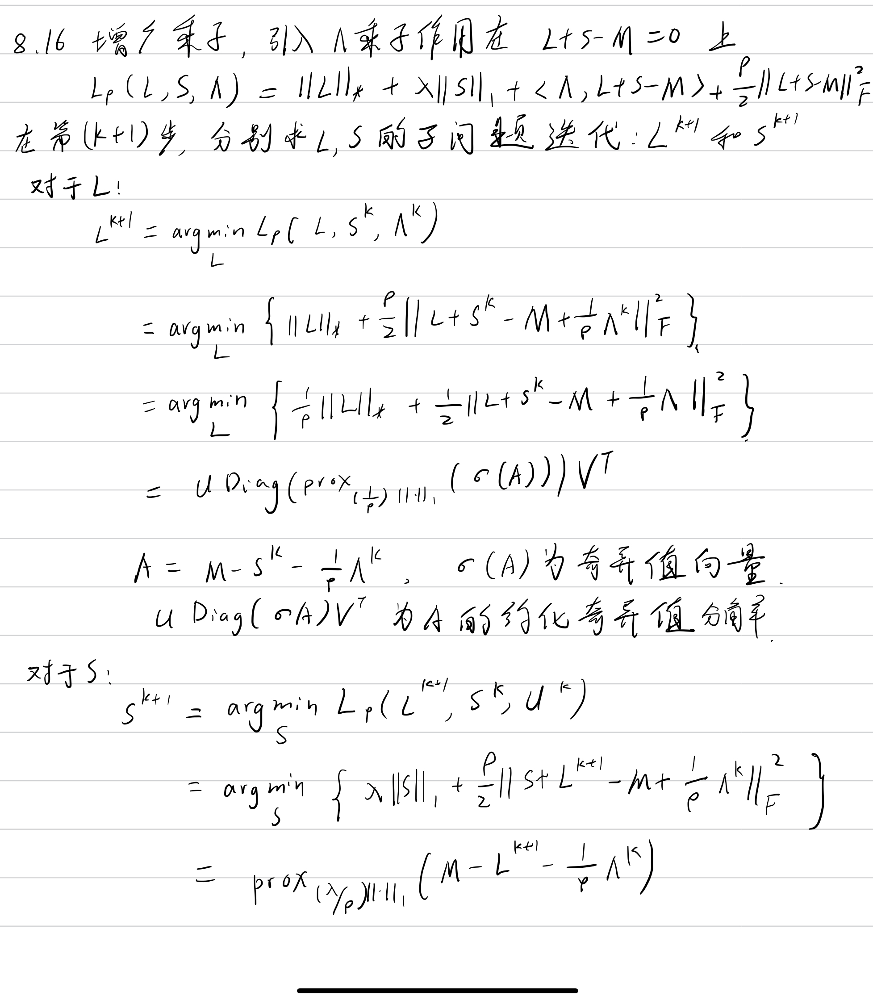
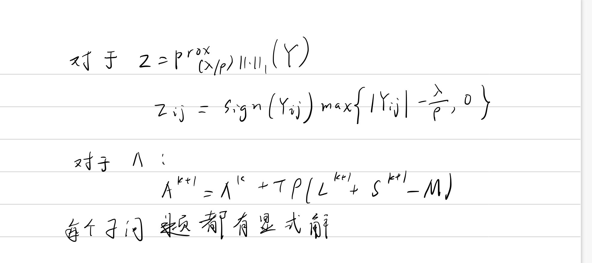
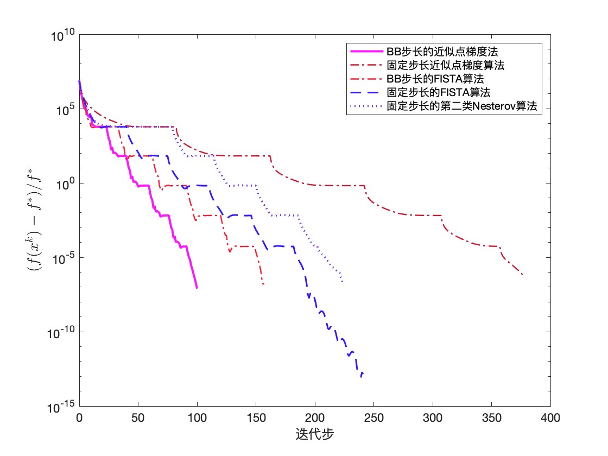
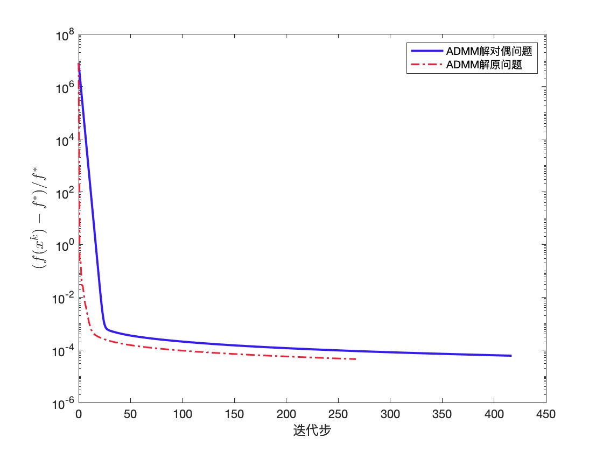
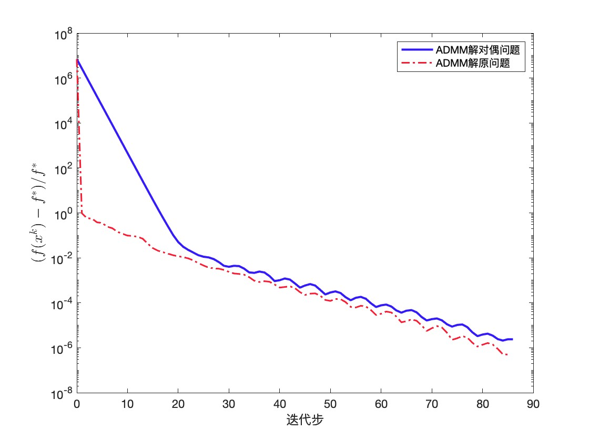

# 机器学习中的优化算法第四次作业:

> 项晨东 2019011831

### 书面作业






### 编程实现

代码说明:

admm代码: `admm/admm.m`

prox_grad代码: `prox_grad/demo.m`

代码总体参考了[教材代码](http://faculty.bicmr.pku.edu.cn/~wenzw/optbook/pages/contents/contents.html)

#### 邻近算子梯度法以及相应的加速算法

以教材的代码作为参考, 参数如下：
```matlab
seed = 42;
m = 1024;
n = 1024;
```
得到如下结果：


可以得到如下的结论：
- 对于近似点梯度算法，使用BB步长和固定步长，可以发现BB步长大收敛速度更快，这说明在平时的运用中使用BB步长更有利于收敛。
- 在固定步长的下，加速算法都能比非加速算法快，FISTA 算法相较于第二类Nesterov 算法稍快。
- 在BB步长下，带线搜索的近似点梯度算法可以比同样设定的FISTA算法更快。

#### 交替方向乘子法
以教材的代码作为参考, 参数如下：
```matlab
seed = 42;
m = 1024;
n = 1024;
```
得到如下结果：



```matlab
seed = 42;
m = 1024;
n = 2048;
```
得到如下结果：


可以得到如下结论：  
可见在不同的矩阵大小情况不同，1024X1024的情况原问题的收敛速度更快，总体曲线平滑。在1024X2048的情况下愿问题收敛更快，但是快的不多，同时曲线有波浪形状。


最后感谢助教和老师的辛苦付出！