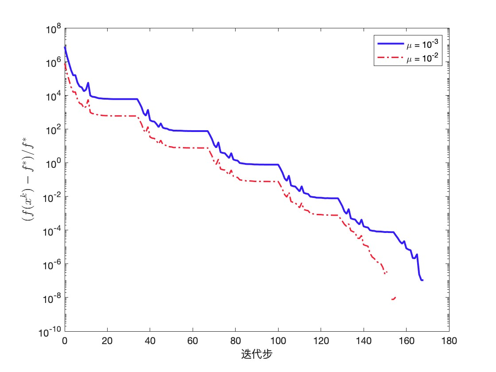

# MLopt 第二次作业

> xcd 2019011831


## 前言
梯度下降算法是通过求参数对于优化目标的梯度，进行不断迭代求解的方式进行问题的优化和求解。对于梯度算法，每一步迭代需要确定两个重要的参数：
1. 优化的方向
2. 前进的步长
对于确定前进步长，有很多的算法和搜索准则，在此不一一介绍。

梯度算法依赖梯度的存在，对于如何使得梯度存在，一种方法是利用转化和光滑的方式来使得梯度存在，另一种是使用次梯度的方法。

在面临约束优化的问题时，一种常见的方法就是罚函数法。将约束条件以合适的方式加入目标函数，一起优化。在二次罚函数中，罚因子必须未无穷才能保证可行性，但是这会导致数值不稳定难以求解。

增广拉格朗日函数法ALM通过对二次罚函数进行修正，使得在有限的罚因子下也能得到较好的结果。

## 试验模型
对于无约束优化问题，本实验构建了一个 LASSO 问题，利用 Huber 光滑化方法通过以光滑函数逼近1-范数。然后使用梯度法求解


$$ \displaystyle \min_x \frac{1}{2}\|Ax-b\|_2^2+\mu\|x\|_1. $$

光滑化函数：
$$ \displaystyle\ell_\sigma(x)=\left\{
\begin{array}{ll}
\frac{1}{2\sigma}x^2, & |x|<\sigma; \\
|x|-\frac{\sigma}{2}, & \mathrm{otherwise}.
\end{array} \right. $$

此外对于约束优化问题，本实验构建了一个迹追踪问题：
$$ \min\|x\|_1,\quad \mathrm{s.t.}\quad Ax=b$$
约束优化问题可以转化为如下的无约束优化问题：
$$\min \|x\|_1+\frac{\sigma}{2}\|Ax-b\|^2, $$
 其中 $\sigma$ 为罚因子。 


## GDM
求导数之后获得优化放下，随后确定。

线搜索准则为 $f(x^k+\alpha d^k)\le C_k+\rho\alpha (g^k)^\top d^k$，其中$\rho$为1e-6。
其中递推常数，满足 $C_0=f(x^0)$

 $$ C_{k+1}=(\gamma
     Q_kC_k+f(x^{k+1}))/Q_{k+1}$$
其中
$$
    Q_0=1,\ Q_{k+1}=\gamma
     Q_{k}+1
$$


### 数值试验
以教材的代码作为参考：
参数如下：
```
seed = 42;
m = 1024;
n = 1024;
```

得到如下结果：



注意到算法在200步之内就收敛了，一个可能的原因是矩阵是方阵，比非方阵有好优化的性质。


## SGM

```
seed = 422;
m = 512;
n = 1024;
```

http://faculty.bicmr.pku.edu.cn/~wenzw/optbook/pages/lasso_subgrad/l1_subgrad.html


## 罚函数法
```
seed = 42;
m = 512;
n = 1024;
opts.maxit = 1000;
```

http://faculty.bicmr.pku.edu.cn/~wenzw/optbook/pages/pm_bp/demo_cont.html


## ALM
```
seed = 42;
m = 512;
n = 1024;
```
http://faculty.bicmr.pku.edu.cn/~wenzw/optbook/pages/alm_bp/demo_alm.html


### ALM 和罚函数法之间的对比